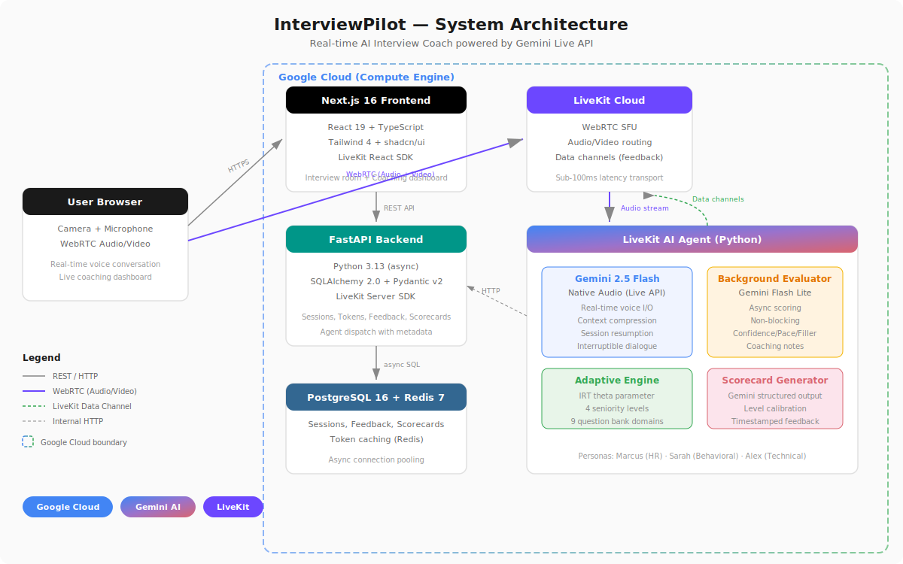

# InterviewPilot — AI Interview Coach That Sees, Hears, and Coaches You in Real Time

> **Live Agent** built for the [Gemini Live Agent Challenge](https://devpost.com/software/interviewpilot) — a real-time voice AI interview coach powered by Gemini 2.5 Flash Native Audio over LiveKit WebRTC, deployed on Google Cloud.

**Live Demo:** [https://liveapi-hackathon.sumanpaudel.me](https://liveapi-hackathon.sumanpaudel.me)

---

## The Problem

Interview preparation is broken. Candidates practice alone with flashcards or generic question lists, with no feedback on *how* they sound — their confidence, pacing, filler words, or ability to structure answers under pressure. Professional mock interviews cost $100-300/session and require scheduling days in advance.

## The Solution

InterviewPilot is a real-time AI interview coach that conducts natural voice-based mock interviews with adaptive difficulty. You talk to it like a real interviewer — it listens, responds, adapts to your skill level, and coaches you live.

**What makes it different:**

- **Real-time voice conversation** — not text-in/text-out. Uses Gemini Live API's native audio for natural, interruptible dialogue with distinct interviewer personas
- **Live coaching dashboard** — confidence score, pace analysis, and filler word detection updated in real-time as you speak
- **Adaptive difficulty** — uses Item Response Theory (theta parameter) to calibrate question difficulty to your actual performance level, not just what you self-reported
- **Post-interview scorecard** — timestamped feedback, level calibration (Junior → Staff+), and actionable improvement areas generated by Gemini

## Features

### Three Interviewer Personas
Each mode has a distinct Gemini voice persona with specialized expertise:

- **HR Interview** (Marcus, Charon voice) — culture fit, motivation, career goals
- **Behavioral Interview** (Sarah, Kore voice) — STAR-format deep dives, leadership scenarios
- **Technical Interview** (Alex, Puck voice) — system design, coding concepts, architecture decisions

### Real-Time Coaching Dashboard
While you speak, the dashboard shows live metrics:
- Confidence score (0-100) based on specificity, structure, and decisiveness
- Pace analysis (slow/good/fast) tracking speech rhythm
- Filler word counter (um, uh, like, you know, basically...)
- Timestamped coaching notes with actionable suggestions

### Adaptive Difficulty Engine
Questions aren't random — they're calibrated:
- Item Response Theory theta parameter adjusts per answer
- 4 seniority levels: Junior (L3-L4), Mid (L4-L5), Senior (L5-L6), Staff+ (L6-L7+)
- 6 role types with specialized question banks
- 9 technical domains (Python, JS, TS, Java, Go, ML/AI, System Design, Behavioral, HR)

### Post-Interview Scorecard
After the interview, Gemini generates a comprehensive scorecard:
- Overall score with level calibration
- Category breakdown (technical, communication, problem-solving)
- Timestamped observations with suggestions
- Performance trend charts

---

## Architecture



```
┌─────────────────┐         ┌─────────────────┐        ┌──────────────┐
│   Next.js 16    │  REST   │   FastAPI        │  SQL   │ PostgreSQL   │
│   Frontend      │────────▶│   Backend        │───────▶│ + Redis      │
│   (React 19,    │         │   (Python 3.13)  │        │              │
│    Tailwind 4,  │         │                  │        │ Google Cloud │
│    shadcn/ui)   │         │  Google Cloud    │        │ Compute      │
└────────┬────────┘         │  Compute Engine  │        └──────────────┘
         │                  └─────────────────-┘
         │ WebRTC (Audio + Video)
         ▼
┌─────────────────┐         ┌──────────────────────────────────────┐
│   LiveKit       │  Audio  │   AI Agent (Python)                  │
│   Cloud         │────────▶│                                      │
│   (WebRTC SFU)  │         │   ┌──────────────────────────────┐   │
│                 │◀────────│   │  Gemini 2.5 Flash            │   │
│                 │  Audio  │   │  Native Audio (Live API)     │   │
└─────────────────┘         │   │  - Real-time voice I/O       │   │
                            │   │  - Context window compression│   │
                            │   │  - Session resumption        │   │
                            │   │  - Proactive responses       │   │
                            │   └──────────────────────────────┘   │
                            │                                      │
                            │   ┌──────────────────────────────┐   │
                            │   │  Background Evaluator        │   │
                            │   │  (Gemini Flash Lite)         │   │
                            │   │  - Async response scoring    │   │
                            │   │  - Runs outside audio stream │   │
                            │   └──────────────────────────────┘   │
                            │                                      │
                            │   Google Cloud Compute Engine        │
                            └──────────────────────────────────────┘
```

### Data Flow

1. **User joins** → Frontend requests LiveKit token from backend with interview config
2. **Token includes metadata** → Backend embeds session config in `RoomAgentDispatch.metadata`
3. **Agent connects** → Reads config from dispatch metadata, builds persona-specific system prompt
4. **Voice conversation** → Gemini Live API handles real-time audio I/O via LiveKit WebRTC
5. **Background evaluation** → Each candidate response is scored asynchronously by Gemini Flash Lite
6. **Live feedback** → Scores sent to frontend via LiveKit data channels (not REST polling)
7. **Interview ends** → Gemini generates structured scorecard, posted to backend, frontend redirects

---

## Tech Stack

| Layer | Technology | Purpose |
|-------|------------|---------|
| **AI Model** | Gemini 2.5 Flash Native Audio (Live API) | Real-time voice conversation with native audio I/O |
| **AI Evaluation** | Gemini Flash Lite | Background response scoring (async, non-blocking) |
| **AI Scorecard** | Gemini | Post-interview scorecard generation |
| **Agent Framework** | LiveKit Agents SDK 1.4 + Google GenAI SDK | Agent orchestration with Gemini Live integration |
| **Realtime** | LiveKit Cloud (WebRTC SFU) | Low-latency audio/video transport + data channels |
| **Frontend** | Next.js 16, React 19, TypeScript, Tailwind 4, shadcn/ui | Modern web UI with real-time dashboard |
| **Backend** | FastAPI, async SQLAlchemy 2.0, Pydantic v2 | REST API with async PostgreSQL |
| **Database** | PostgreSQL 16, Redis 7 | Session persistence + caching |
| **Cloud** | Google Cloud Compute Engine, Artifact Registry | Production hosting + container registry |
| **VAD** | Silero VAD | Voice activity detection for turn-taking |
| **Infrastructure** | Docker Compose, uv (Python), pnpm (Node) | Containerized deployment |

### Google Cloud Services Used

- **Compute Engine** — Hosts all three services (backend, agent, frontend) in Docker containers
- **Artifact Registry** — Container image storage and versioning
- **Gemini API** (via Google AI Studio) — Powers the interview agent (Live API), background evaluator, and scorecard generator

---

## Quick Start (Reproducible Setup)

### Prerequisites

- Docker & Docker Compose v2.20+
- [LiveKit Cloud account](https://livekit.io) (free tier works)
- [Google AI Studio API key](https://aistudio.google.com/apikey) with Gemini 2.5 Flash access

### 1. Clone and configure

```bash
git clone https://github.com/sumansaurabh/interviewpilot.git
cd interviewpilot
cp .env.example .env
```

Edit `.env` with your credentials:
```env
LIVEKIT_URL=wss://your-project.livekit.cloud
LIVEKIT_API_KEY=your_key
LIVEKIT_API_SECRET=your_secret
GOOGLE_API_KEY=your_gemini_api_key
NEXT_PUBLIC_LIVEKIT_URL=wss://your-project.livekit.cloud
NEXT_PUBLIC_API_URL=http://localhost:8000
```

### 2. Start all services

```bash
# Start infrastructure + backend
docker compose up -d postgres redis backend

# Wait for backend to be healthy
docker compose exec backend curl -s http://localhost:8000/api/v1/health

# Start the AI agent
docker compose --profile agent up -d agent

# Start the frontend
docker compose --profile frontend up -d frontend
```

Or start everything at once:
```bash
docker compose --profile agent --profile frontend up -d
```

### 3. Open the app

Visit [http://localhost:3000](http://localhost:3000), configure your interview, and start practicing.

### Local Development (without Docker)

```bash
# Backend
cd backend && uv sync && uv run uvicorn app.main:app --reload

# Agent
cd agent && uv sync && uv run python agent.py dev

# Frontend
cd web && pnpm install && pnpm dev
```

---

## Production Deployment (Google Cloud)

The production deployment uses automated scripts. See [DEPLOYMENT.md](DEPLOYMENT.md) for full details.

```bash
# Build, push, and deploy all services
./deploy.sh --all
```

This script:
1. Builds Docker images for linux/amd64
2. Pushes to Google Cloud Artifact Registry
3. SSHs into the GCE instance and pulls + restarts services

Live at: [https://liveapi-hackathon.sumanpaudel.me](https://liveapi-hackathon.sumanpaudel.me)

---

## Project Structure

```
interviewpilot/
├── web/                     # Next.js 16 frontend
│   └── src/
│       ├── app/             # App Router (landing, setup, interview, scorecard)
│       ├── components/      # UI components (interview/, scorecard/, landing/)
│       ├── hooks/           # Real-time feedback, session, timer hooks
│       └── lib/             # API client, types, constants
│
├── backend/                 # FastAPI backend (Python 3.13)
│   └── app/
│       ├── api/v1/          # REST endpoints
│       ├── models/          # SQLAlchemy models
│       ├── schemas/         # Pydantic schemas
│       ├── services/        # Token generation, session management
│       └── middleware/       # Rate limiting, security headers
│
├── agent/                   # LiveKit AI Agent
│   ├── agents/              # Interview agent classes (Base, HR, Behavioral, Technical)
│   ├── config/              # Personas, seniority profiles, question selection
│   ├── core/                # API client, scorecard generator, Gemini patch
│   ├── prompts/             # YAML-driven dynamic prompt system
│   └── question_banks/      # 9 curated question banks (3400+ questions)
│
├── infra/                   # Postgres init scripts
├── docs/                    # Architecture and design specs
├── deploy.sh                # Automated GCP deployment script
├── docker-compose.yml       # Development stack
├── docker-compose.prod.yml  # Production overrides
└── .env.example             # Environment template
```

## API Reference

| Method | Path | Description |
|--------|------|-------------|
| POST | `/api/v1/sessions` | Create interview session |
| GET | `/api/v1/sessions/{id}` | Get session details |
| POST | `/api/v1/sessions/{id}/start` | Mark session active |
| POST | `/api/v1/sessions/{id}/end` | End session |
| POST | `/api/v1/feedback` | Submit real-time feedback metrics |
| POST | `/api/v1/coaching/note` | Log coaching observation |
| GET | `/api/v1/scorecards/{session_id}` | Get interview scorecard |
| POST | `/api/v1/token` | Generate LiveKit token with agent dispatch |
| GET | `/api/v1/health` | Health check |

---

## Key Technical Decisions

### Why Gemini Live API (not standard Gemini)?
Standard Gemini requires text transcription → LLM → TTS — adding 2-3 seconds of latency per turn. Gemini Live API handles audio natively end-to-end, enabling natural conversational flow with interruption support. This is critical for interview coaching where timing and flow matter.

### Why background evaluation instead of tool calls?
Gemini Realtime's tool call mechanism blocks the audio pipeline — the model pauses speaking while waiting for tool results. By running a separate Gemini Flash Lite instance for evaluation *outside* the realtime pipeline, we get async scoring without interrupting the conversation. This saves ~1-2 seconds per evaluation.

### Why LiveKit data channels for feedback?
REST polling would add latency and server load. LiveKit's data channels deliver feedback metrics directly over the existing WebRTC connection with sub-100ms latency, enabling truly real-time dashboard updates.

### Why Item Response Theory for difficulty?
IRT theta provides a mathematically grounded way to estimate candidate ability from sparse data (a few questions). Unlike simple "easy/medium/hard" buckets, theta continuously adjusts based on response quality, converging on the candidate's true level within 3-4 questions.

---

## Hackathon Category

**Live Agents** — Real-time voice interaction with Gemini Live API. The agent conducts natural interviews, handles interruptions gracefully, adapts difficulty in real-time, and provides live coaching — all through voice conversation.

### Mandatory Requirements Met

- [x] Leverages Gemini model (Gemini 2.5 Flash Native Audio + Gemini Flash Lite)
- [x] Built using Google GenAI SDK (google-genai Python package)
- [x] Uses Google Cloud services (Compute Engine + Artifact Registry)
- [x] Multimodal I/O — real-time audio input/output via Gemini Live API
- [x] Beyond text-in/text-out — voice conversation with live visual dashboard

---

## License

MIT License — see [LICENSE](LICENSE) for details.

## Author

**Suman Paudel** — [GitHub](https://github.com/sumansaurabh) · [LinkedIn](https://linkedin.com/in/sumanpaudel)

Built with Gemini Live API, LiveKit, and Google Cloud for the Gemini Live Agent Challenge.
